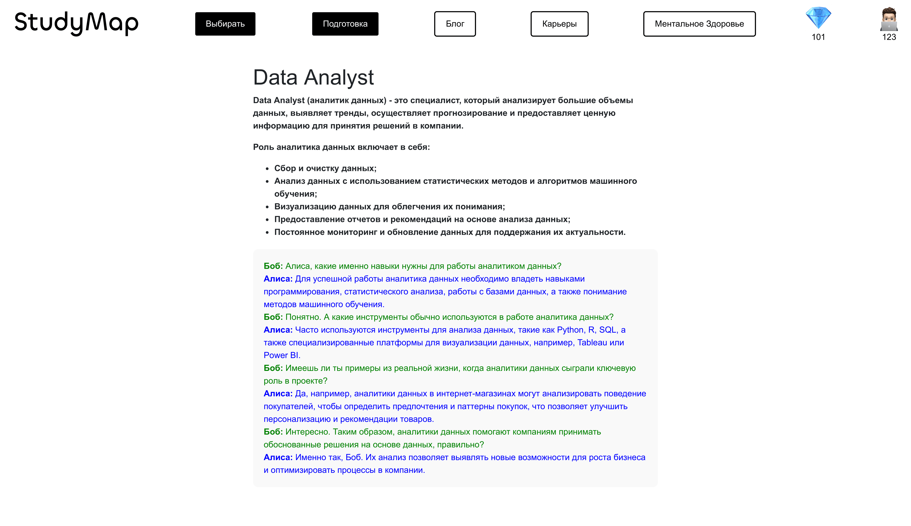

# studymap

## EdTech that brings your future to you.

Imagine you are a 16-18 year old teenager and you have to make a decision which will have a drastic impact on your future, quite a tough choice. These people are at the decisive stage of choosing an educational path and are looking for information about future educational programs and professions. This project is dedicated to broadening applicants’ horizons by providing the accessible data regarding educational programs, but what is more important is the guidance at their personal choice and custom path selection. To combine one’s interest, life goals, and education.

### Career guidance platform.

## Start Your Own Journey: Sign In & Sign Up

## Recommendations Tailored to Your Preferences: Filters and AI

## Get to Build Yor Future Here

## Choose Your Future Self

## Engage in the Community of Like-Minded people

## Mental Health as the Top Priority

